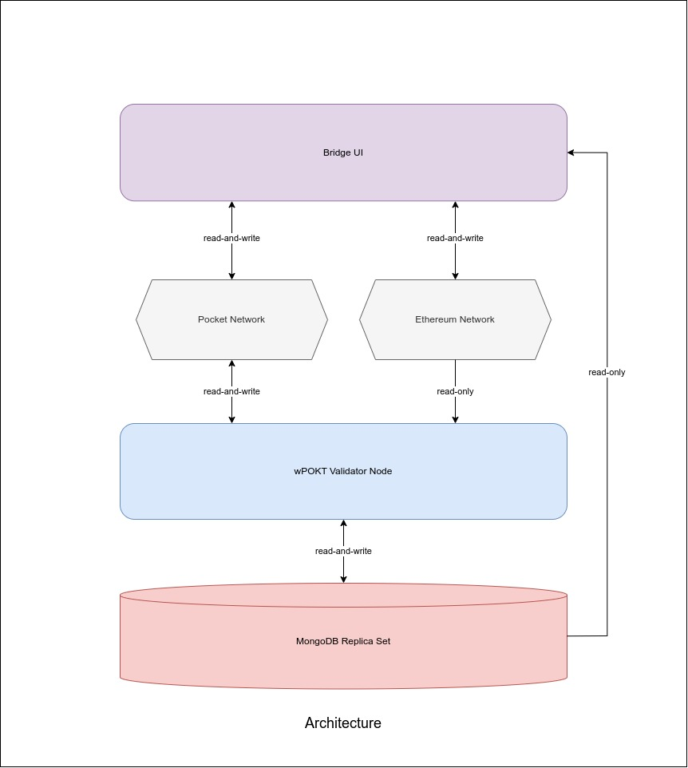

# wPOKT Validator <!-- omit in toc -->

The wPOKT Validator is a validator node that facilitates the bridging of POKT tokens from the POKT network to wPOKT on the Ethereum Mainnet.

- [How It Works](#how-it-works)
- [Installation](#installation)
- [Usage](#usage)
  - [Configuration](#configuration)
  - [Using Docker Compose](#using-docker-compose)
- [Valid Memo](#valid-memo)
- [Docker Image](#docker-image)
- [Unit Tests](#unit-tests)
- [End-to-End Tests](#end-to-end-tests)
- [Flows](#flows)
  - [Architecture](#architecture)
  - [Burn Flow](#burn-flow)
  - [Mint Flow](#mint-flow)
- [License](#license)

## How It Works

The wPOKT Validator comprises seven parallel services that enable the bridging of POKT tokens from the POKT network to wPOKT on the Ethereum Mainnet. Each service operates on an interval specified in the configuration. Here's an overview of their roles:

1. **Mint Monitor:**
   Monitors the Pocket network for transactions to the vault address. It validates transaction memos, inserting both valid `mint` and `invalid mint` transactions into the database.

2. **Mint Signer:**
   Handles pending and confirmed `mint` transactions. It signs confirmed transactions and updates the database accordingly.

3. **Mint Executor:**
   Monitors the Ethereum network for `mint` events and marks mints as successful in the database.

4. **Burn Monitor:**
   Monitors the Ethereum network for `burn` events and records them in the database.

5. **Burn Signer:**
   Handles pending and confirmed `burn` and `invalid mint` transactions. It signs the transactions and updates the status.

6. **Burn Executor:**
   Submits signed `burn` and `invalid mint` transactions to the Pocket network and updates the database upon success.

7. **Health:**
   Periodically reports the health status of the Golang service and sub-services to the database.

Through these services, the wPOKT Validator bridges POKT tokens to wPOKT, providing a secure and efficient validation process for the entire ecosystem.

## Installation

No specific installation steps are required. Users should have Golang installed locally and access to a MongoDB instance, either running locally or remotely, that they can attach to.

## Usage

To run the wPOKT Validator, execute the following command:

```bash
go run .
```

### Configuration

The wPOKT Validator can be configured in the following ways:

1. Using a Config File:

   - A sample configuration file `config.sample.yml` is provided.
   - You can specify the config file using the `--config` flag:

   ```bash
   go run . --config config.yml
   ```

2. Using an Env File:

   - A sample environment file `sample.env` is provided.
   - You can specify the env file using the `--env` flag:

   ```bash
   go run . --env .env
   ```

3. Using Environment Variables:
   - Instead of using a config or env file, you can directly set the required environment variables in your terminal:
   ```bash
   ETH_PRIVATE_KEY="your_eth_private_key" ETH_RPC_URL="your_eth_rpc_url" ... go run .
   ```

If both a config file and an env file are provided, the config file will be loaded first, followed by the env file. Non-empty values from the env file or provided through environment variables will take precedence over the corresponding values from the config file.

### Using Docker Compose

You can also run the wPOKT Validator using `docker compose`. Execute the following command in the project directory:

```bash
docker compose --env-file .env up --build
```

## Valid Memo

The validator node requires transactions on the POKT network to include a valid memo in the format of a JSON string. The memo should have the following structure:

```json
{ "address": "0xC9F2D9adfa6C24ce0D5a999F2BA3c6b06E36F75E", "chain_id": "5" }
```

- `address`: The recipient address on the Ethereum network.
- `chain_id`: The chain ID of the Ethereum network (represented as a string).

Transactions with memos not conforming to this format will not be processed by the validator.

## Docker Image

The wPOKT Validator is also available as a Docker image hosted on [Docker Hub](https://hub.docker.com/r/dan13ram/wpokt-validator). You can run the validator in a Docker container using the following command:

```bash
docker run -d --env-file .env docker.io/dan13ram/wpokt-validator:latest
```

Ensure you have set the required environment variables in the `.env` file or directly in the command above.

## Unit Tests

To assess the individual components of the wPOKT Validator, follow these steps:

1. **Execute Unit Tests:**

   - Open your terminal and run the unit tests using the command:
     ```shell
     go test -v ./...
     ```

2. **Check Coverage:**
   - To check the test coverage of the codebase, use the following command:
     ```shell
     ./coverage.sh
     ```

## End-to-End Tests

To test the core functionalities of the wPOKT Validator in a controlled environment, follow these steps:

1. **Navigate to E2E Directory:**

   - Open your terminal and move to the `./e2e` directory in the project.

2. **Start Local Network:**

   - Within the `./e2e` directory, execute the following commands to set up the local network:
     ```shell
     make clean
     make network
     ```
   - Please allow up to 5 minutes for the local network to be fully operational.

3. **Run Tests:**
   - Once the local network is ready, initiate the end-to-end tests using the command:
     ```shell
     make test
     ```
   - You need node v18 to run the tests

## Flows

The following diagrams illustrate the architecture and flows of the wPOKT Validator.

They are surfaced here from [wpokt-validator/tree/main/diagrams](https://github.com/pokt-network/wpokt-validator/tree/main/diagrams).

### Architecture



### Burn Flow


### Mint Flow


## License

This project is licensed under the MIT License.
